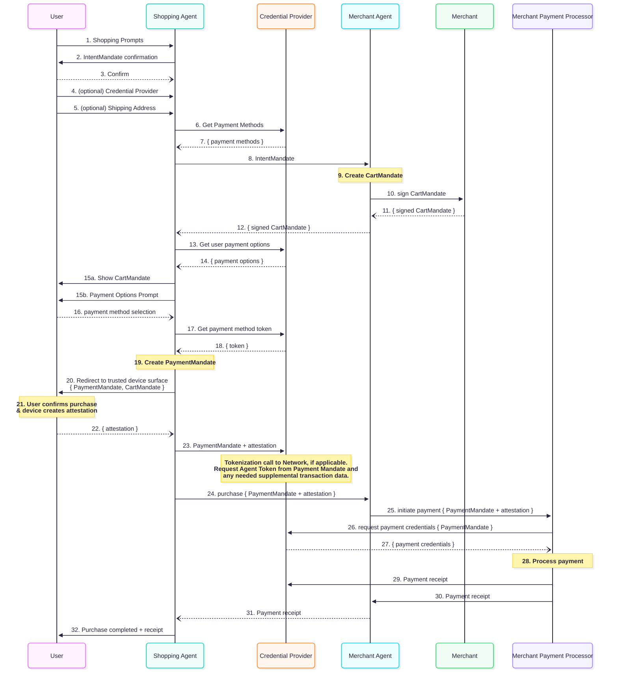

# Protocolo de Pagamentos de Agentes (AP2): Construindo um Futuro Seguro e Interoperável para Pagamentos Orientados por IA

## Resumo Executivo

Os agentes de IA redefinirão o cenário do comércio digital, prometendo conveniência, personalização e eficiência sem precedentes. No entanto, essa mudança expõe um desafio fundamental: a infraestrutura de pagamentos### 5.3 Adição de Método de Pagamento

Dependendo do apetite de risco deles, os comerciantes devem ter a capacidade de exigir um
nível mínimo de segurança associado ao método de pagamento se ele for
- Passo 14: O Mandato de Pagamento contém informações que podem ser anexadas ao
    pacote de autorização de transação existente que fornecerá visibilidade para
    PSP/Redes/Emissores de que a transação teve envolvimento de Agente de IA e sua
    modalidade (Humano Presente ou Não Presente).
    - Observe que isso é distinto do "Mandato do Carrinho" que contém todas
        as informações que um comerciante requer para cumprir o pedido. para uma transação agentiva. As redes de pagamento também podem definir requisitos de segurança
ou tokenização para transações agentivas que devem ser aplicados
pelo comerciante antes que uma transação possa ser iniciada.

Se o Usuário iniciar uma solicitação de compra com um Agente de Compras sem ter
quaisquer métodos de pagamento elegíveis com seu Provedor de Credenciais, o CP deve ser
capaz de fornecer instrução ao Usuário via o Agente de Compras sobre configurar um
método de pagamento e torná-lo pronto para transações agentivas. Isso pode exigir um fluxo de
tokenização que o usuário pode precisar executar em uma superfície de Pagamentos confiável de propriedade do Provedor de Credenciais ou da rede/emissor.mundo não foi projetada para um futuro onde agentes autônomos e não humanos atuam em nome de um usuário, ou transacionam entre si. Os protocolos de pagamento atuais, construídos com base na suposição de interação direta do usuário humano com uma interface confiável, carecem dos mecanismos para validar com segurança a autenticidade e autoridade de um agente para transacionar. Isso expõe uma defesa de longa data contra fraudes online, cria ambiguidade em torno da responsabilidade da transação e ameaça a adoção, não apenas do comércio de agentes, mas também impacta negativamente o comércio digital existente.

Sem um protocolo comum e confiável, a indústria enfrenta a perspectiva de um ecossistema fragmentado e inseguro, caracterizado por soluções proprietárias e isoladas que aumentam a complexidade para comerciantes, criam atrito para usuários e impedem que instituições financeiras avaliem uniformemente o risco. Para abordar essa lacuna, este protocolo propõe um protocolo aberto e interoperável para pagamentos de agentes. Este protocolo, projetado como uma extensão para protocolos emergentes de agente-para-agente (A2A) e protocolo de contexto de modelo (MCP), estabelece uma estrutura segura e confiável para o comércio orientado por IA.

## Um Convite para Colaborar: Roteiro e Engajamento da Comunidade

O sucesso deste protocolo fundamental para pagamentos de agentes depende da participação ampla da indústria, feedback e apoio público. Convidamos todas as partes interessadas no ecossistema de comércio e pagamentos a se juntarem para refinar e construir este protocolo aberto.

### Roteiro Proposto

O desenvolvimento e implementação do protocolo são previstos em uma abordagem faseada, permitindo que o ecossistema construa, teste e adote capacidades de forma incremental.

- **V0.1**: A especificação inicial foca em estabelecer a arquitetura principal e habilitar os casos de uso mais comuns. Recursos principais incluem:
    - Suporte para métodos de pagamento "pull" (por exemplo, cartões de crédito/débito)
    - Cargas de dados bem definidas para suportar responsabilidade transparente baseada no framework VDC
    - Suporte para cenários humano-presente
    - Suporte para desafios de escalonamento iniciados por usuário e comerciante
    - Diagrama de sequência detalhado e implementação de referência usando o [protocolo A2A](https://a2a-protocol.org/)
- **V1.x**: Versões subsequentes expandirão as capacidades do protocolo com base no feedback da comunidade e necessidades em evolução. Áreas potenciais de foco incluem:
    - Suporte completo para pagamentos "push" e todos os métodos de pagamento (por exemplo, transferências bancárias em tempo real, carteiras eletrônicas etc.)
    - Fluxos padronizados para pagamentos recorrentes e assinaturas
    - Suporte para cenários humano-não-presente
    - Diagramas de sequência detalhados para implementações baseadas em MCP
- **Visão de Longo Prazo**: A longo prazo, planejamos que o protocolo incorpore mais inteligência e flexibilidade, incluindo:
    - Suporte nativo para topologias de transação complexas e multi-comerciantes
    - Suporte para negociações em tempo real entre agentes compradores e vendedores

Acreditamos que uma abordagem colaborativa é essencial para criar um protocolo que seja robusto, seguro e atenda às diversas necessidades de todo o ecossistema. Buscamos ativamente feedback e crítica no repositório github através de issues e discussões.

## Seção 1: A Nova Fronteira do Comércio: Por que os Pagamentos de Agentes Precisam de um Protocolo Fundamental

### 1.1 O Surgimento do Comércio de Agentes

A evolução da interação digital está entrando em uma nova fase, movendo-se além da manipulação direta de UIs para execução de tarefas conversacionais e delegadas. Os agentes de IA estão se tornando rapidamente atores primários, capazes de entender solicitações complexas do usuário e executar tarefas multistep de forma autônoma. No comércio, isso se traduz em uma mudança de paradigma onde os agentes gerenciarão tudo, desde compras rotineiras e gerenciamento de assinaturas até pesquisa complexa de produtos, negociação de preços e agrupamento dinâmico de pedidos em vários vendedores. Este novo era do comércio de agentes promete desbloquear um valor imenso, oferecendo aos usuários uma experiência de compras hiperpersonalizada e sem atrito, ao mesmo tempo em que fornece aos comerciantes novos canais inteligentes para alcançar e servir clientes.

### 1.2 A Lacuna Fundamental: Uma Crise de Confiança e Responsabilidade

Apesar de sua promessa, o surgimento do comércio de agentes expõe uma vulnerabilidade crítica na infraestrutura de pagamentos digitais existente. Os protocolos de pagamento atuais são projetados em torno do princípio de um usuário humano interagindo diretamente com uma interface confiável, como o site de um comerciante ou o aplicativo de um provedor de pagamento. Autenticação, autorização e responsabilidade são todas predeterminadas nessa interação humana direta.

Agentes autônomos quebram essa suposição. Quando um agente inicia um pagamento, surgem questões fundamentais que os sistemas atuais não estão equipados para responder:

- Autorização e Auditabilidade: Que prova verificável demonstra que o usuário concedeu autoridade específica ao agente para fazer essa compra particular?
- Autenticidade da Intenção: Como um comerciante ou processador de pagamento pode ter certeza de que a solicitação do agente reflete com precisão a verdadeira intenção do usuário humano?
- Erro de Agente e "Alucinação": Como o sistema protege contra erros de agentes, como interpretar mal uma solicitação do usuário ou "alucinar" detalhes do produto, o que poderia levar a compras incorretas?
- Responsabilidade: Em caso de uma transação fraudulenta ou errônea, quem é responsável? O usuário que delegou a tarefa? O desenvolvedor do agente de compras? O comerciante que aceitou o pedido? Ou a rede de pagamento que processou?

Essa ambiguidade cria uma crise de confiança. Sem uma estrutura robusta para validar autoridade de agentes e atribuir responsabilidade de forma clara, as instituições financeiras podem ser relutantes em aprovar transações iniciadas por agentes, os comerciantes serão expostos a níveis inaceitáveis de risco de fraude, e os usuários serão relutantes a delegar autoridade financeira a agentes.

### 1.3 O Risco de um Ecossistema Fragmentado

Na ausência de um protocolo universalmente adotado, a indústria inevitavelmente
se moverá em direção a um conjunto de soluções proprietárias e fechadas. Grandes varejistas
podem desenvolver integrações personalizadas para seus agentes específicos, e provedores de
pagamento podem criar ecossistemas isolados que não interoperam. Esta
fragmentação teria consequências negativas severas:

- Para os Usuários: Uma experiência confusa e inconsistente, onde seu agente preferido pode
    funcionar apenas com um conjunto limitado de comerciantes ou métodos de pagamento.
- Para os Comerciantes: Custos altos de desenvolvimento e manutenção para suportar múltiplas
    integrações de pagamentos de agentes não-padrão, criando uma barreira significativa para
    pequenas e médias empresas.
- Para o Ecossistema de Pagamentos: Uma incapacidade de coletar sinais comuns em todas as
    transações de agentes para mitigar consistentemente fraudes, levando a custos mais altos e
    taxas de aprovação de transações suprimidas.

Um protocolo aberto e interoperável é o caminho mais viável para frente. Ele cria uma
linguagem comum para todos os participantes. Permite que pontos de dados adicionais sejam
compartilhados sobre a transação de uma forma que não era possível antes e garante
que qualquer agente compatível possa transacionar com segurança com qualquer comerciante compatível,
fomentando um mercado competitivo e inovador.

## Seção 2: Princípios Orientadores para uma Economia de Agentes Confiável

O design deste protocolo proposto está enraizado em um conjunto de princípios fundamentais destinados a construir um ecossistema sustentável, seguro e equitativo para todos os participantes. Estes princípios servem como a base filosófica para a arquitetura técnica que se segue.

### 2.1 Abertura e Interoperabilidade

Este protocolo é proposto como uma extensão aberta e não proprietária para protocolos existentes e futuros de agente-para-agente (A2A) e protocolo de contexto de modelo (MCP). O objetivo é fornecer uma camada de pagamentos comum e interoperável que pode ser adotada por qualquer jogador do ecossistema. Esta abordagem fomenta um ambiente saudável e competitivo onde os desenvolvedores podem inovar nas capacidades dos agentes, os comerciantes podem alcançar o público mais amplo possível, e os usuários podem escolher a combinação de agentes e serviços que melhor atenda às suas necessidades.

### 2.2 Controle do Usuário e Privacidade por Design

O usuário deve sempre ser a autoridade máxima. O protocolo é projetado para
garantir que os usuários tenham controle granular e visibilidade transparente sobre as
atividades de seus agentes.

A privacidade é um princípio fundamental de design. O protocolo é projetado para proteger informações sensíveis do usuário, incluindo o conteúdo de seus prompts de conversação e detalhes de pagamento pessoal. Através da criptografia de payload e uma arquitetura baseada em funções, os agentes envolvidos no processo de compras são impedidos de acessar dados de cartão de pagamento sensíveis (PCI) ou outras informações pessoalmente identificáveis (PII), que são tratadas exclusivamente pelas entidades especializadas e os elementos seguros da infraestrutura de pagamento.

### 2.3 Intenção Verificável, Não Ação Inferida

A confiança em um sistema de Agente de IA não pode ser baseada apenas na interpretação de saídas ambíguas, probabilísticas de um grande modelo de linguagem. As transações devem ser ancoradas em prova determinística, não-repudiável de intenção de todas as partes. Este princípio aborda diretamente o risco de "alucinação" de agentes e má interpretação.

### 2.4 Responsabilidade Clara da Transação

Para que o ecossistema de pagamentos abrace o comércio de agentes, não pode haver ambiguidade
quanto à responsabilidade da transação. Um objetivo primário deste protocolo é fornecer
evidência de apoio que ajude as redes de pagamento a estabelecer princípios de responsabilidade
e responsabilidade. Esta clareza é fundamental para ganhar a confiança e participação de
comerciantes, emissores e redes de pagamento.

## Seção 3: Visão Geral da Arquitetura: Um Ecossistema Baseado em Funções para Transações Seguras

Para alcançar seus objetivos de segurança, interoperabilidade e responsabilidade clara,
o protocolo proposto define uma arquitetura baseada em funções. Cada ator no
ecossistema tem um conjunto distinto e bem definido de responsabilidades, garantindo uma
separação de preocupações que aumenta a segurança e simplifica a integração.

### 3.1 Os Atores

O ecossistema de pagamentos de agentes consiste nas seguintes funções principais:

- **O Usuário**: O indivíduo humano que inicia uma tarefa de comércio delegando-a ao seu Agente. O Usuário é a fonte máxima de intenção e autoridade financeira.
- **O Agente do Usuário (UA) ou Agente de Compras (SA)**: Esta é a Superfície de IA que interage diretamente com o usuário. O Agente do Usuário (UA) pode delegar a tarefa de comércio a outro Agente de IA (digamos, o Agente de Compras ou "SA"). Suas funções principais incluem entender as necessidades do usuário, descobrir produtos, interagir com comerciantes para construir um carrinho, e obter a autorização assinada do usuário para iniciar uma tarefa relacionada ao pagamento.
- **O Provedor de Credenciais do Usuário (CP)**: Uma entidade segura responsável pelo gerenciamento e execução seguros de credenciais de pagamentos (ex.: uma carteira digital). Ela detém conhecimento dos métodos de pagamento disponíveis do Usuário, obtém o consentimento do usuário (se considerado necessário) para compartilhar credenciais com o SA, seleciona o método de pagamento ideal com base nas preferências do usuário e contexto da transação, e lida com cenários de pagamento como erros, declínios e desafios de transação de forma elegante.
- **O Endpoint Remoto ou do Comerciante (ME)**: Uma interface web, endpoint MCP ou
    um agente de IA operando em nome de uma entidade que espera receber um
    pagamento em troca de oferecer produtos ou serviços. Seus objetivos são exibir
    produtos/serviços, fornecer informações, negociar o conteúdo de um
    carrinho com um Agente de Compras, e confirmar que tem informações suficientes sobre a
    intenção do usuário para entregar os produtos/serviços certos.
- **O Endpoint do Processador de Pagamento do Comerciante (MPP)**: O Processador de Pagamento do Comerciante (web, API, MCP ou Agente de IA) pode ser o mesmo que o Comerciante se o
    Comerciante tiver todas as capacidades para cumprir esta função. O MPP constrói
    a mensagem de autorização txn que pode ser enviada ao ecossistema de pagamento para
    autorização.
- **Rede e Emissor**: O provedor da rede de pagamento e emissor de
    credenciais de pagamento para o usuário humano. O Provedor de Credenciais pode precisar
    interagir com a rede para emissão de tokens específicos para transações de agentes de IA
    e o Comerciante/PSP pode enviar essas transações para autorização aos emissores via
    redes.


### 3.2 O Fluxo de Confiança

#### 3.2.1 Curto Prazo

No futuro imediato, a confiança do ecossistema de pagamentos será estabelecida através de
listas de permissão aprovadas, curadas manualmente.

- O Agente de Compras pode escolher trabalhar com um registro confiável de
    Provedores de Credenciais
- O Provedor de Credenciais pode escolher trabalhar com um registro confiável de
    Agentes de Compras
- O Agente de Compras definirá quais comerciantes ele pode suportar com segurança. Isso
    pode ser através de integrações pré-estabelecidas ou descoberta em tempo real via
    web-crawling ou outras capacidades agentic. Inversamente, os comerciantes também podem
    ter um registro de confiança de Agentes de Compras.

Estes registros são descentralizados e curados manualmente pelos proprietários da entidade
(_ex.: o provedor do Agente de Compras decide que quer permitir lista limitada de
provedores de credenciais populares mas não outros_). Isso é menos trabalho do que a abordagem atual da indústria de integrações ponto a ponto onde há trabalho de desenvolvimento necessário para cada integração bespoke.


#### 3.2.2 Longo Prazo

A longo prazo, antecipamos que os protocolos MCP e A2A incorporarão
métodos adicionais para afirmar as identidades tanto do Agente quanto do Usuário
que ele representa. Isso permitirá que Comerciantes ou Agentes de Compras identifiquem um
Provedor de Credenciais e facilitem o estabelecimento em tempo real de confiança entre
eles. Consequentemente, o Provedor de Credenciais pode verificar que um Agente de Compras está
operando em nome de <johndoe@gmail.com>, e que um endpoint específico de comerciante está
representando genuinamente um comerciante real. Similarmente, o Provedor de Credenciais deve ser
confiado pelo Agente de Compras & Endpoint do Comerciante para ser
autêntico e representar adequadamente <johndoe@gmail.com>. Esta estrutura de confiança irá alavancar e estender padrões web estabelecidos como HTTPS, propriedade de DNS, mTLS, e troca de chave API.

## Section 4: Trust Anchors: Verifiable Digital Credentials & Mandates

The central innovation of this protocol is the mechanism by which it engineers
trust into a distributed and potentially adversarial environment. This is
accomplished through the interplay of a set of standardized, cryptographically
secure data objects known as verifiable digital credentials (VDCs).

### 4.1 The Language of Trust: Verifiable Digital Credentials (VDCs)

Verifiable digital credentials are the standardized data structures used to convey
trusted information between agents. They are tamper-evident, non-disputable,
portable, and cryptographically signed digital objects that serve as the
building blocks of a transaction. The primary VDCs in this framework are the Cart
Mandate, the Intent Mandate and the Payment Mandate.

#### 4.1.1 The Cart Mandate

The Cart Mandate is the foundational credential that captures the user's
authorization for a purchase when the human is present at the time of purchase
([see illustrative user journey](#51-transação-com-humano-presente)). It is
generated by the Merchant based on the user's request and is cryptographically
signed by the user, typically using a hardware-backed key on their device with
in-session authentication. This signature binds the user's identity and
authorization to their intent. The Cart Mandate is a structured object
containing critical parameters that define the scope of the transaction.

A Cart Mandate contains the following bound information:

- Payer and Payee Information: Verifiable identities for the user, the
    merchant, and their respective Credential Providers.
- Payment Method: A tokenized representation of the single, specific payment
    method to be charged, as selected by the Credentials Provider and confirmed
    by the user.
- Risk Payload: A container for risk-related signals required by merchants,
    payment processors and issuers
- Transaction Details: The final, exact transaction products, destination
    (email or physical address), amount and currency.
- If applicable, the conditions under which the purchase can be refundable

#### 4.1.2 The Intent Mandate

The Intent Mandate is a separate verifiable digital credential which is critical for
scenarios where the human is not present at actual transaction time
([veja como isso se conecta à jornada “humano não presente”](#41-transação-com-humano-não-presente)).
It serves as the final, non-repudiable authorization to execute a purchase in
the user’s absence. It is generated by the Shopping Agent based on the user's
request and is cryptographically signed by the user, typically using a
hardware-backed key on their device.

An Intent Mandate may contain the following bound information (_not that some of
it may vary depending on human-present and human-not-present scenario_):

- Payer and Payee Information: Verifiable identities for the user, the
    merchant, and their respective Credential Providers.
- Chargeable Payment Methods: A list or category of payment methods the user
    has authorized for the transaction.
- Risk Payload: A container for risk-related signals required by merchants,
    payment processors and issuers
- Shopping Intent: Parameters defining the purchase, such as product
    categories, or specific SKUs and relevant purchase decision criteria like
    refundability.
- Prompt Playback: The Agent’s understanding of the User’s prompt in natural
    language.
- Time-to-Live (TTL): An expiration time for the mandate's validity.

#### 4.1.3 The Payment Mandate for AI Agent Visibility to Payments Ecosystem

While the Cart and Intent mandates are required by the merchant to fulfill the
order, separately the protocol provides additional visibility into the agentic
transaction to the payments ecosystem. For this purpose, a verifiable digital credential
“PaymentMandate” (_bound to Cart/Intent mandate but containing separate
information_) may be shared with the network/issuer along with the standard
transaction authorization messages. The PaymentMandate’s goal is to help the
network/issuer build trust into the agentic transaction and it contains the
below information.

- AI Agent presence and transaction modality (Human Present v/s Not Present)
    signals must always be shared
- With user consent, the issuer and/or network may contractually enforce rules
    which require the sharing of additional information present in Cart and/or
    Intent Mandates for purposes such as fraud prevention.
- At time of disputes, merchants may use the full cart and/or intent mandates
    as evidence during representment with the network/issuer as defined by
    network rules.

This architecture represents a significant evolution from traditional,
imperative API calls (e.g., `create_order`) to a model of "contractual
conversation." The protocol messages are not simply commands; they are steps in
a formal, auditable negotiation that culminates in a binding digital contract.
This declarative, consensus-driven model is inherently more secure and robust
for the complex, multi-party interactions that will define the agentic era,
providing a far stronger foundation for trust and dispute resolution than any
client-server API model can offer and paves the way for future security
enhancements like Digital Payment Credentials and other cryptographic
approaches.

## Section 5: Core User Journeys

### 5.1 Transação com Humano Presente

O usuário delega uma tarefa a um Agente de IA que requer um pagamento a ser feito (por exemplo,
compras) e o usuário está disponível quando o pagamento precisa ser autorizado. Uma
maneira típica (mas não a única) de isso acontecer é a seguinte:

- Configuração: O Usuário pode configurar uma conexão entre seu Agente de Compras
    preferido e qualquer um dos Provedores de Credenciais suportados. Isso pode exigir que o Usuário
    se autentique em uma superfície de propriedade do Provedor de Credenciais.

- Descoberta e Negociação: O Usuário fornece uma tarefa de compras ao seu
    Agente de IA escolhido (_que pode ativar um Agente de Compras especializado para completar a
    tarefa_). O Agente de Compras interage com um ou mais Comerciantes para montar
    um carrinho que satisfaça a solicitação do Usuário. Isso pode incluir a capacidade do
    comerciante de fornecer informações de fidelidade, ofertas, venda cruzada e venda adicional
    (_via a integração entre o Agente de Compras e o Comerciante_) que o
    Agente de Compras deve representar ao usuário.

- Comerciante Valida Carrinho: Um SKU ou conjunto de SKUs são autorizados pelo Usuário para
    compra. Isso é comunicado pelo Agente de Compras ao Comerciante para
    iniciar a criação do pedido. O Comerciante deve assinar o Carrinho que eles criam
    para um usuário, sinalizando que cumprirão este carrinho.

- Fornecer Métodos de Pagamento: O Agente de Compras pode fornecer o contexto de pagamento
    ao Provedor de Credenciais e solicitar um método de pagamento aplicável (compartilhado
    como referência ou em forma criptografada), junto com qualquer informação de fidelidade/desconto
    que possa ser relevante para a seleção do método de pagamento (_por exemplo,
    pontos do cartão que podem ser resgatados para a txn_).

- Mostrar Carrinho: O Agente de Compras apresenta o carrinho final e o método de pagamento
    aplicável ao usuário em uma superfície confiável e o usuário pode aprová-lo via um
    processo de autenticação.

- Assinar e Pagar: A aprovação assinada do usuário deve criar um
    “Mandato de Carrinho” assinado criptograficamente. Este mandato contém os bens explícitos sendo
    comprados e sua confirmação de compra. É compartilhado com o Comerciante
    para que eles possam usá-lo como evidência em caso de disputas. Separadamente, o
    PaymentMandate (_contendo sinais de envolvimento do agente e Humano-Presente_) pode
    ser compartilhado com a rede e emissor para autorização da transação.

- Execução do Pagamento: O subconjunto de pagamento do “Mandato de Carrinho” deve ser transmitido
    ao Provedor de Credenciais e Comerciante para completar a transação. Pode haver
    várias maneiras de isso acontecer. Por exemplo,

    - O Agente de Compras (SA) pode solicitar ao Provedor de Credenciais para completar um
        pagamento com o Comerciante OU,
    - o SA pode enviar um pedido ao comerciante, acionando um fluxo de autorização de pagamento onde o comerciante/PSP solicita método de pagamento do
        Provedor de Credenciais.

- Enviar Transação ao Emissor: O Comerciante ou PSP roteia a transação para
    o emissor ou a rede dentro da qual o método de pagamento opera. O pacote de
    transação pode ser anexado com sinais de presença de agente de IA garantindo
    que a rede/emissor tenha visibilidade em transações agentivas.

- Desafio: Qualquer parte (emissor, provedor de credenciais, comerciante etc.) pode escolher
    desafiar a transação através de mecanismos existentes como 3DS2. Este desafio
    precisa ser apresentado ao usuário pelo Agente do Usuário (_um exemplo
    disso seria um 3DS hospedado_) e pode exigir um redirecionamento para uma superfície confiável
    para completar.

- Resolver Desafio: O usuário deve ter uma maneira de resolver o desafio em uma
    superfície confiável (por exemplo, app bancário, website etc.)

- Autorizar Transação: O emissor aprova o pagamento e confirma o sucesso
    de volta. Isso é comunicado ao Usuário e ao Comerciante para que o pedido
    possa ser cumprido. Um recibo de pagamento é compartilhado com o Provedor de Credenciais
    confirmando o resultado da transação. Em caso de declínio, isso também pode ser
    apropriadamente comunicado.

### 4.1 Transação com Humano Não Presente

O usuário delega uma tarefa a um Agente de IA que requer um pagamento a ser feito (por exemplo, compras) e o usuário quer que o Agente de IA proceda com o pagamento em sua ausência. Alguns cenários canônicos aqui poderiam ser "_compre estes sapatos para mim quando o preço cair abaixo de $100_" ou "_compre 2 ingressos para este concerto assim que eles ficarem disponíveis, certifique-se de que estamos próximos ao palco principal, mas não gaste mais de $1000_".

As principais mudanças da modalidade Humano Presente são notadas abaixo:

1. "Prompt do Carrinho Não Necessário": O Agente deve repetir de volta ao Usuário o que eles acham que devem comprar. O Usuário deve aprovar isso e confirmar que gostaria que o agente procedesse com a compra em sua ausência. Isso é feito pelo Usuário passando por autenticação em sessão (biométrica etc.) para confirmar sua intenção.

2. "Mandato de Intenção" é assinado pelo usuário em vez do "Mandato do Carrinho" em cenários "Humano Não Presente". "Mandato de Intenção" inclui a descrição em linguagem natural da intenção do usuário como entendida pelo Agente de IA. Isso é assinado pelo usuário e compartilhado com o Comerciante para que eles possam decidir se são capazes de cumprir o requisito do usuário.

3. Comerciante pode forçar confirmação do usuário: Se o Comerciante não tiver certeza sobre sua capacidade de cumprir as necessidades do usuário, eles podem forçar o usuário a voltar à sessão para confirmar. Aqui, o comerciante pode exigir (i) o usuário selecionar entre um conjunto de SKUs apresentados a eles ou (ii) fornecer respostas a perguntas adicionais que o comerciante precisa saber. (i) pode levar à criação de mandato de carrinho Humano-Presente e (ii) pode levar à atualização do "mandato de intenção" com mais informações. Isso garante que os Comerciantes obtenham mais confiança na intenção do usuário se não tiverem certeza. Os comerciantes podem equilibrar taxas de conversão de transações com retornos/insatisfação do usuário para decidir quando querem forçar os usuários a fornecer confirmação adicional.

Cenário de Exemplo

- Usuário diz ao SA: "Compre 2 ingressos para _<este concerto>_ de _<este comerciante>_ assim que eles ficarem disponíveis para o show de Vegas em julho. Seu orçamento é $1000 e gostaríamos de estar o mais próximo possível do palco principal"

- Usuário assina isso como um Mandato de Intenção permitindo que o SA compre na ausência do usuário.

- Comerciante recebe este mandato de intenção e então eles podem dizer "Eu tenho 3 variações de assentos que atendem a estes critérios e não sei qual o usuário quer. O mandato de intenção não é suficiente para mim cumprir este pedido".

- O comerciante pode responder ao SA e dizer que quero mostrar ao usuário as 3 opções finais.

- SA notifica o usuário que sua presença é necessária antes que a txn possa ser iniciada. Usuário vê as 3 opções, escolhe uma e agora pode assinar um "Mandato do Carrinho" que dá ao comerciante evidência de que o usuário sabe exatamente o que está recebendo.

Alternativamente, o comerciante pode ter decidido cumprir o pedido com os ingressos mais baratos que atendam aos critérios. Isso ficaria a cargo do comerciante e eles podem decidir quando querem trazer o usuário de volta à sessão e quando são capazes de cumprir o pedido sem trazer o usuário de volta.

### 5.3 Payment Method Addition

Depending on their risk appetite, merchants should have the ability to require a
minimum level of security associated with the payment method if it’s going to be
accepted for an agentic transaction. Payment networks may also define security
or tokenization requirements for agentic transactions which should be enforced
by the merchant before a transaction can be initiated.

If the User initiates a purchase request with a Shopping Agent without having
any eligible payment methods with their Credentials Provider, the CP should be
able to provide instruction to the User via the Shopping Agent on setting up a
payment method and making it ready for agentic transactions. This may require a
tokenization flow which the user may have to perform on a trusted Payments
surface owned by the Credentials Provider or the network/issuer.

### 5.4 Seleção de Método de Pagamento

O comerciante definirá quais métodos de pagamento eles aceitam e as taxas associadas.
Se aplicável, o comerciante também declarará qual processador eles usam. Se
o método de pagamento for um método de pagamento push, o comerciante definirá para onde
empurrar os fundos. Uma vez no contexto de um carrinho, o comerciante pode definir o subconjunto
de métodos de pagamento suportados.

O comerciante também pode declarar que já tem métodos de pagamento do usuário armazenados
“em arquivo” caso em que o Agente de Compras pode não precisar usar um Provedor de
Credenciais.

O Provedor de Credenciais sabe quais métodos de pagamento o usuário tem disponíveis. O
Agente de Compras poderá consultar sobre os métodos de pagamento do usuário para
garantir que os métodos de pagamento do usuário sejam compatíveis com os métodos aceitos pelo Comerciante
de pagamento.

### 5.5 Desafios de Transação

Qualquer jogador no ecossistema pode exigir um desafio do usuário durante um fluxo de pagamento.
Para v0.1, isso será um desafio de redirecionamento passado de volta ao Agente de Compras para
superfície ao Usuário. O Usuário será redirecionado para uma superfície confiável para
completar o desafio. Isso permitirá desafios atuais do usuário como 3DS2,
ou OTPs serem usados como desafios para transações agentivas.

O Provedor de Credenciais deve estar ciente quando um desafio é realizado, para que
a informação de um tipo de desafio bem-sucedido possa ser passada para as entidades relevantes
(comerciantes e emissores) garantindo que o usuário não seja desafiado duas vezes se o
emissor ou comerciante já confiar nos desafios concluídos. Para o cenário “Humano Não Presente”, um desafio de transação forçará o usuário a entrar
na sessão. Todos os sistemas de risco existentes que comerciantes, redes e emissores instituíram,
devem ainda ser capazes de raciocinar sobre os dados que estão recebendo e
identificar quando os desafios são necessários, garantindo compatibilidade retroativa.

## Seção 6: Habilitando Resolução de Disputas

Uma estrutura clara e previsível para lidar com transações disputadas é
fundamental para a adoção de qualquer novo protocolo de pagamento por instituições financeiras,
comerciantes e usuários. Este protocolo é projetado para fornecer um
sistema certificado, baseado em evidências para atribuir responsabilidade.

### Princípios Fundamentais

Os princípios fundamentais são que a responsabilidade deve

1. Permanecer semelhante às regulamentações e processos existentes o máximo possível,
   inovar apenas onde necessário
2. Seguir prova verificável usando a cadeia criptográfica de evidências que
   cria um rastro de auditoria irrefutável
3. Recair em uma entidade do mundo real (usuário, comerciante ou emissor) para a vasta maioria
   dos casos e apenas recair em um Agente de IA se uma decisão de suporte de carga feita pelo
   Agente de IA for determinada como errada (como, Tomada de Conta de Agente levando
   a compras em nome de um bom usuário por um fraudador).

No caso de uma disputa, o adjudicador da rede (Rede de Cartão, provedor de e-Wallet,
agência governamental etc.) pode receber informações adicionais do
Comerciante, incluindo o carrinho, hash, e mandato de carrinho/intenção junto com a
evidência que eles já coletam. O adjudicador pode então tomar uma decisão sobre
se o usuário aprovou o carrinho final e o comerciante entregou o que o usuário solicitou.

Este processo é conscientemente mantido semelhante aos fluxos de disputa existentes, especialmente
na rede de cartão, permitindo que comerciantes conectem evidências adicionais que
os apoiam em disputas permitindo que participem de transações agentivas
com confiança.

A tabela a seguir descreve como a responsabilidade poderia ser alocada em vários cenários comuns
de falha, com base nas evidências disponíveis dentro do protocolo. Observe
que cada rede de pagamento definirá seus próprios contratos de responsabilidade e assim esta
tabela fornece apenas um guia útil, não um contrato vinculativo de qualquer tipo.

Tabela 6.1: Novas Evidências em Cenários Comuns

| Tipo de Cenário             | Descrição                                                                                                                                                                    | Evidência Principal                                                                                                                   |
| :-------------------------- | :--------------------------------------------------------------------------------------------------------------------------------------------------------------------------- | :------------------------------------------------------------------------------------------------------------------------------------- |
| Uso Indevido de Primeira Parte | O usuário legítimo inicia uma compra, mas posteriormente alega que foi fraudulenta para obter um reembolso.                                                                   | Mandato de Carrinho ou Mandato de Intenção assinado pelo usuário Credencial Digital Verificável (VDC)                                  |
| Escolha Errada, Aprovada pelo Usuário | O Agente de Compras seleciona o item errado (por exemplo, sapatos azuis em vez de vermelhos), mas o usuário aprova explicitamente o carrinho final contendo o item errado. | O VDC do mandato de carrinho, assinado pela chave do dispositivo do usuário, mostra o item incorreto.                                   |
| Escolha Errada, Não Aprovada pelo Usuário | O Agente de Compras compra autonomamente um item que viola o Mandato de Intenção assinado pelo usuário (por exemplo, excede o orçamento ou é o item errado).               | O Mandato de Intenção versus os detalhes da transação do carrinho devem mostrar a discrepância.                                        |
| Não Cumprimento pelo Comerciante | O comerciante aceita o pagamento por um pedido, mas falha em enviar os bens ou prestar o serviço.                                                                          | Um Mandato de Carrinho/Intenção válido e confirmação de pagamento versus a ausência de uma confirmação válida de envio/cumprimento do comerciante. |
| Assunção de Conta (ATO)      | Um fraudador ganha controle da conta de um usuário e usa seu Agente de IA para fazer compras não autorizadas com métodos de pagamento pré-existentes no Provedor de Credenciais do usuário. | Análise de sinais de autenticação durante a sessão e assinatura do mandato.                                                            |
| Ataque Man-in-the-Middle     | Um atacante intercepta e altera um payload de transação em trânsito (por exemplo, altera o endereço de envio).                                                              | Verificação de assinaturas digitais e integridade do payload. Os VDCs assinados são projetados para tornar isso inviável.              |

## Seção 7: Implementação Técnica

Com base no roteiro definido no início deste documento, esta seção
se concentrará na implementação técnica para o cenário Humano-Presente no
caso específico onde todas as entidades são Agentivas - Usuário/Agente de Compras, Comerciante,
e Provedor de Credenciais. Isso significaria que essas entidades aproveitam o
[protocolo A2A](https://a2a-protocol.org/) para troca de informações.

Consideramos o MCP igualmente importante e planejamos seguir com implementações de referência
onde algumas entidades podem ser MCP muito em breve após publicar a
primeira versão das especificações.

### 7.1 Fluxo de Transação Ilustrativo



Alguns pontos salientes do diagrama de fluxo:

- Passo 4: O usuário pode precisar fornecer um endereço de entrega ou o Agente de Compras
    pode já tê-lo com base nas preferências/configurações do usuário. Isso é
    para garantir que o preço no carrinho seja final. Todas as seleções que podem alterar um
    preço do carrinho devem ser concluídas antes que o Mandato de Carrinho possa ser
    criado.
- Passo 6: O mandato do carrinho é primeiro assinado pela entidade do comerciante (não um
    Agente) para garantir que eles cumprirão o pedido com base no SKU, preço e
    informações de entrega. Isso garante que o usuário veja um carrinho (no passo 12)
    que o comerciante confirmou cumprir.
- Passo 10: Opções de Pagamento podem ser recebidas de um Provedor de Credenciais ou podem
    ser fornecidas pelo comerciante diretamente caso eles já tenham armazenado informações de método de pagamento.
- Passo 13: O usuário pode ser obrigado a elevar seu método de pagamento através de um fluxo de
    segurança/tokenização se a rede de pagamento tiver requisitos específicos de
    segurança/tokenização para transações de Agente de IA.
- Step 14: The PaymentMandate contains information that can be appended to the
    existing transaction authorization packet which will provide visibility to
    PSP/Networks/Issuers that the transaction had AI Agent involvement and its
    modality (Human Present or Human Not Present).
    - Note that this is distinct from the “Cart Mandate” which contains all
        the information which a merchant requires to fulfill the order.
- Passo 15: Este é o passo fundamental onde o usuário verifica tudo
    e prossegue para fazer uma compra
- Passo 21: Embora não mostrado no diagrama, esperamos que o PSP envie o
    mensagem de autorização da transação (junto com o Mandato de Pagamento) para
    redes/emissores de suporte, permitindo que essas partes raciocinem sobre as
    transações e tomem uma decisão (aprovar/negar/desafiar).

### 7.2 Code Samples

#### Sample Merchant Agent Card

```json
{
  "name": "MerchantAgent",
  "description": "A sales assistant agent for a merchant.",
  "capabilities": {
    "extensions": [
      {
        "description": "Supports the A2A payments extension.",
        "required": true,
        "uri": "https://google-a2a.github.io/A2A/ext/payments/v1"
      },
      {
        "description": "Supports the Visa payment method extension",
        "required": true,
        "uri": "https://visa.github.io/paymentmethod/types/v1"
      }
    ]
  },
  "skills": [
    {
      "id": "search_catalog",
      "name": "Search Catalog",
      "description": "Finds items in the merchant's catalog",
      "tags": ["merchant", "search", "catalog"]
    }
  ],
  "url": "http://example.com/a2a/merchant_agent",
  "version": "1.0.0"
}
```

#### Sample Credential Provider Agent Card

```json
{
  "name": "CredentialProvider",
  "description": "An agent that holds a user's payment credentials.",
  "capabilities": {
    "extensions": [
      {
        "description": "Supports the A2A payments extension.",
        "required": true,
        "uri": "https://google-a2a.github.io/A2A/extensions/payments/v1"
      },
      {
        "description": "Supports the Visa payment method extension",
        "required": true,
        "uri": "https://visa.github.io/paymentmethod/types/v1"
      }
    ]
  },
  "security": [
    {
      "oauth2": ["get_payment_methods"]
    }
  ],
  "securitySchemes": {
    "oauth2": {
      "flows": {
        "authorizationCode": {
          "authorizationUrl": "http://example.com/auth",
          "scopes": {
            "get_payment_methods": "description"
          },
          "tokenUrl": "http://127.0.0.1:8080/token"
        }
      },
      "type": "oauth2"
    }
  },
  "skills": [
    {
      "id": "get_eligible_payment_methods",
      "description": "Provides a list of payment methods for a purchase.",
      "name": "Get Eligible Payment Methods",
      "tags": ["eligible", "payment", "methods"]
    },
    {
      "id": "get_account_shipping_address",
      "description": "Fetches the shipping address in the user's account.",
      "name": "Get Shipping Address",
      "tags": ["account", "shipping"]
    }
  ],
  "url": "http://example.com/a2a/credential_provider",
  "version": "1.0.0"
}
```

#### Sample `CartMandate`

```json
{
  "contents": {
    "id": "cart_shoes_123",
    "user_signature_required": false,
    "payment_request": {
      "method_data": [
        {
          "supported_methods": "CARD",
          "data": {
            "payment_processor_url": "http://example.com/pay"
          }
        }
      ],
      "details": {
        "id": "order_shoes_123",
        "displayItems": [
          {
            "label": "Nike Air Max 90",
            "amount": {
              "currency": "USD",
              "value": 120.0
            },
            "pending": null
          }
        ],
        "shipping_options": null,
        "modifiers": null,
        "total": {
          "label": "Total",
          "amount": {
            "currency": "USD",
            "value": 120.0
          },
          "pending": null
        }
      },
      "options": {
        "requestPayerName": false,
        "requestPayerEmail": false,
        "requestPayerPhone": false,
        "requestShipping": true,
        "shippingType": null
      }
    }
  },
  "merchant_signature": "sig_merchant_shoes_abc1",
  "timestamp": "2025-08-26T19:36:36.377022Z"
}
```

#### Sample `PaymentMandate`

```json
{
  "payment_details": {
    "cart_mandate": "<user-signed hash of the cart mandate>"
    "payment_request_id": "order_shoes_123",
    "merchant_agent_card": {
      "name": "MerchantAgent"
    },
    "payment_method": {
      "supported_methods": "CARD",
      "data": {
        "token": "xyz789"
      },
    },
    "amount": {
      "currency": "USD",
      "value": 120.0,
    },
    "risk_info": {
      "device_imei": "abc123"
    },
    "display_info": "<image bytes>"
  },
  "creation_time": "2025-08-26T19:36:36.377022Z"
}
```

### 7.3 Dispute Flows

O protocolo permite que os comerciantes recebam evidências adicionais, na forma de
mandatos de intenção e carrinho. Estes são blobs JSON seguros e imutáveis que são prova
do que foi acordado, pelo humano e pelo comerciante no momento da transação.
Estes JSONs são assinados por uma chave (digamos, uma chave de dispositivo) que é apoiada por uma entidade
(digamos, o emissor) que atesta que a chave é boa.

No caso de uma disputa, esta evidência adicional junto com a chave pública pode
ser compartilhada com a autoridade adjudicadora permitindo que eles validem a
autenticidade do blob JSON e obtenham acesso às instruções específicas que
levaram à compra. Isso permite que o adjudicador use esses dados junto com
dados de disputas existentes para tomar decisões sobre qual parte pode ser responsável pela
transação.

### 7.4: Risk Signals

Cada entidade no ecossistema de pagamentos tem processos bem definidos para gerenciar
risco e reduzir fraude. O protocolo não visa ser opinativo sobre
manipulação de risco/fraude ou impor mudanças a sistemas bem estabelecidos. Esta
seção fornece nosso pensamento inicial sobre como o cenário pode evoluir.

Como o usuário agora interage com um Agente de Compras, que por sua vez interage com
Provedores de Credenciais e Comerciantes, há algumas implicações novas para
considerar:

- Assincronia do Usuário: O usuário pode não estar mais em sessão para toda a
    jornada de pagamento.
- Confiança Delegada: Os atores devem agora confiar em um agente para iniciar um pagamento em nome do
    usuário.
- Correspondência Mandato-Comerciante: Mandatos para compras devem ser correspondidos com precisão
    ao comerciante pretendido.
- Lacunas Temporais: Tokens de método de pagamento podem ser gerados significativamente antes de uma
    transação ser executada, criando uma janela de oportunidade para uso indevido.
- Estabelecimento de Confiança Indireto: O Provedor de Credenciais pode não ter um engajamento direto
    com o comerciante e deve confiar no Agente de Compras para
    estabelecer confiança.
- Identidade do Agente: O ID do Agente de Compras se torna sinônimo de uma identidade de bot,
    que requer novos métodos de verificação e confiança.

Essas mudanças exigem que cada ator reavalie como estabelecer confiança e
gerenciar risco. Os provedores de credenciais devem agora expandir sua verificação de
propriedade de usuário e instrumento para identificar o Agente de Compras também.

Da mesma forma, as preocupações tradicionais do Comerciante são amplificadas, levando-os a
questionar não apenas como podem confiar no usuário, mas também como podem acessar com segurança
instrumentos do usuário, receber pagamento e obter os dados necessários em um
cenário mediado por um agente.

A implementação v0.1 inclui um campo de Risco na troca JSON entre as
várias entidades, mas é intencionalmente deixado aberto por enquanto, pois esperamos
que diferentes jogadores da indústria avaliem os sinais certos que devem ser
incluídos com base em diferentes apetites de risco e modelos de negócio.

## Seção 8: Olhando para o Futuro: Habilitando Comércio Dinâmico

Este protocolo faz mais do que apenas proteger compras simples. Seu design flexível
fornece uma base para os modelos de comércio avançados e dinâmicos do
futuro.

Imagine um usuário quer comprar uma jaqueta específica, mas a cor que ele quer está listada
como "indisponível" no site do comerciante. Normalmente, isso é uma venda perdida. Mas
com este protocolo, é plausível imaginar que o usuário poderia dizer ao seu
agente, "Eu realmente quero esta jaqueta em verde, e estou disposto a pagar até 20%
mais por ela." O agente pode então criar um **Mandato de Intenção** assinado com esses
detalhes específicos.

O agente do comerciante recebe este mandato e, em vez de uma resposta automática "fora de
estoque", pode reconhecer a intenção de alto valor. Ele poderia verificar o inventário de back-end para um possível retorno, fazer um pedido especial, ou até mesmo fazer uma
exceção de produção. Ele então apresenta uma oferta de preço mais alto de volta ao
agente do usuário. Se o usuário aceitar, **Mandato de Carrinho** e **Mandato de Pagamento** são
ambos assinados, e uma compra é concluída que seria impossível de outra forma. Isso permite que o comerciante capture uma venda de intenção alta e receba
feedback valioso direto sobre a demanda do produto, transformando um beco sem saída em uma
transação bem-sucedida.

## Seção 9: Um Chamado para Colaboração do Ecossistema

O Protocolo de Pagamentos de Agente fornece um mecanismo para pagamentos seguros, mas é
parte de um quadro maior. Reconhecemos que há problemas adjacentes que
precisam ser resolvidos se quisermos fornecer uma experiência verdadeiramente perfeita. O
protocolo deixa essas áreas abertas para o ecossistema inovar. Alguns dos
maiores blocos de construção são:

### Estabelecimento de Confiança em Tempo Real

No topo do funil, o Agente de Compras precisa ser capaz de descobrir
endpoints de Comerciante (seja Agente de IA ou MCP) e estabelecer um alto grau de confiança
com eles para que, posteriormente, um pagamento possa ser iniciado entre essas partes. No
curto prazo, esperamos que isso aconteça através de listas de permissão descentralizadas de
registros que garantam que Agentes de IA e comerciantes possam estabelecer confiança entre
si. A longo prazo, esperamos que isso seja habilitado por novos padrões de descoberta &
verificação.

### Autorização Delegada

Um agente precisa de uma maneira segura e fácil de obter permissões com escopo para agir em nome de um
usuário. Versões iniciais podem usar métodos existentes como redirecionamentos ou
senhas únicas. No entanto, o objetivo de longo prazo é mover em direção a soluções que
ofereçam controles de acesso mais granulares e limitados no tempo para agentes.

### Emissão de Chaves Públicas Confiáveis

A segurança do protocolo depende de informações sendo assinadas criptograficamente pelo
usuário e comerciante. Mas isso levanta uma questão crucial: como as chaves públicas que verificam essas assinaturas são distribuídas, e por que alguém deveria confiar nelas?
Estabelecer essas "raízes de confiança" é uma área crítica para inovação. Vários
caminhos empolgantes poderiam emergir onde essas chaves poderiam ser emitidas por emissores,
redes de pagamento, governos, comerciantes ou redes de terceiros que são
confiadas pelo ecossistema.

Resolver esses desafios é um esforço comunitário e é essencial para desbloquear o
potencial completo e seguro do comércio de agentes.

## Glossário

| Termo | Sigla | Definição | Contexto | Sinônimo/Relacionado |
| :----- | :----- | :--------- | :------- | :------------------- |
| Protocolo de Pagamentos de Agente | AP2 | Um protocolo aberto projetado para permitir que agentes de IA interoperem de forma segura e concluam pagamentos de forma autônoma. |  |  |
| Protocolo Agente2Agente | [A2A](https://a2a-protocol.org/) | Um padrão aberto para comunicação colaborativa segura e gerenciamento de tarefas entre diversos agentes de IA, independentemente de suas estruturas subjacentes. | Uma Extensão de Pagamentos está sendo desenvolvida para facilitar transações financeiras, com foco em pagamentos agentivos de alta confiança. |  |
| Pagamentos Agentivos |  | Fluxos de pagamento nos quais agentes de IA autônomos estão envolvidos |  |  |
| Provedor de Credenciais | CP | Uma entidade segura, como uma carteira digital, responsável por gerenciar e executar as credenciais de pagamento e identidade do usuário. |  |  |
| Prova criptográfica determinística |  | Uma prova matemática única que poderia ser vinculada a um dispositivo de hardware |  |  |
| Vinculação Dinâmica |  | Um requisito fundamental para Autenticação Forte do Cliente (SCA), envolvendo a inclusão de detalhes específicos da transação dentro de uma Credencial de Pagamento para vincular a SCA a essa transação. | Garante que o pagador consinta explicitamente com detalhes da transação como valor e beneficiário. |  |
| Endpoint do Comerciante (Ou Endpoint Remoto) | ME, RE | A interface web ou agente de IA representando o vendedor, exibindo produtos e negociando o carrinho. |  |  |
| Endpoint do Processador de Pagamento do Comerciante | MPP | A entidade responsável por construir e enviar a mensagem de autorização da transação para o ecossistema de pagamento. |  |  |
| Protocolo de Contexto de Modelo | MCP | Um protocolo padronizando como modelos de IA e agentes se conectam e interagem com recursos externos como ferramentas, APIs e fontes de dados. |  |  |
| Beneficiário |  | Uma pessoa ou entidade que é o destinatário pretendido de fundos de uma transação de pagamento. | Pode solicitar atestações junto com confirmação de pagamento. | Comerciante, Nome do Credor |
| Pagador |  | Uma pessoa ou entidade que possui uma conta de pagamento, permite uma ordem de pagamento dessa conta. | Inicia ordens de pagamento. | Usuário, Titular |
| Agente de Pagamento |  | Uma função chave proposta em pagamentos de agentes responsável por selecionar o método de pagamento ideal, validar detalhes de pagamento e lidar com erros. | Um Agente de Pagamento não é um requisito necessário para participar do protocolo. Endpoints baseados em MCP também podem desempenhar funções similares. |  |
| Contratos de Pagamento |  | "Mandatos" ou "Contratos de Pagamento" que capturam instruções específicas do usuário ao seu agente. | Define princípios para pagamentos agentivos seguros e de alta confiança. Eles podem ser globais ou no nível da transação. | Mandatos, Mandato de Compras |
| Credencial de Pagamento |  | Uma credencial ou instrumento (ou referência a um) que pode ser cobrado para um pagamento. |  | Atestação Eletrônica de Atributos (EAA), Atestação de Carteira de Pagamento (PWA), Credenciais Digitais de Pagamento (DPC), Atestação de Meios de Pagamento, Credencial SPC |
| API de Solicitação de Pagamento (Padrão W3C) |  | Uma API web que atua como intermediária entre um comerciante, usuário e provedor de método de pagamento para simplificar a experiência de pagamento. |  |  |
| Autenticação Forte do Cliente | SCA | Um processo exigido por estruturas regulatórias para identificação online e iniciação de transações em serviços financeiros. | Central para o Livro de Regras de Pagamentos, garantindo segurança e vinculação dinâmica de transações. | Autenticação Forte do Usuário, SCA Integrada |
| Usuário |  | O humano iniciando a tarefa e fornecendo autoridade financeira. |  |  |
| Agente do Usuário a.k.a. Agente de Compras | UA, SA | A superfície de IA interage diretamente com o usuário, entendendo suas necessidades e coordenando a compra. |  |  |
| Credencial digital verificável | VDC | Uma credencial assinada pelo Emissor (ou seja, um conjunto de Reivindicações) cuja autenticidade pode ser verificada. | Normalmente vinculada a uma chave criptográfica e usada no modelo emissor-titular-verificador. | Credencial Digital, Credencial Verificável |
| Apresentação verificável | VP | Uma apresentação de uma ou mais VDCs que inclui uma prova criptográfica de vinculação do titular, criada em resposta a uma solicitação de um Verificador. | Permite que um Verificador confirme que o Titular pretendia a apresentação para eles e pode revelar apenas um subconjunto de reivindicações. |  |

> Copyright 2025 Google LLC. Licensed under the Apache License, Version 2.0 (the
> “License”); you may not use this file except in compliance with the License.
> You may obtain a copy of the License at
> <https://www.apache.org/licenses/LICENSE-2.0>
