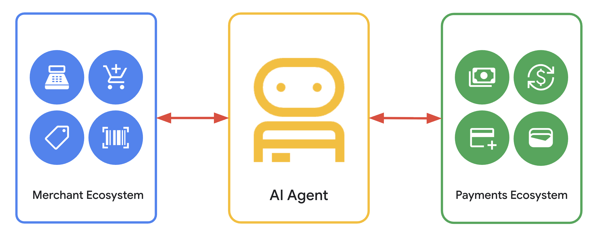

# Visão Geral do AP2

A evolução da interação digital está entrando em uma nova fase, indo além da interação humana direta com sites e aplicativos para execução de tarefas conversacionais e delegadas por agentes de IA. No comércio, isso significa que agentes gerenciarão tudo, desde compras rotineiras até pesquisa complexa de produtos e negociação de preços.

Esta nova era do **comércio agentivo** promete uma experiência de compra hiperpersonalizada e sem atrito para os usuários, ao mesmo tempo em que fornece aos comerciantes novos canais inteligentes para alcançar clientes.

## A Lacuna Fundamental: Uma Crise de Confiança

Apesar de sua promessa, o surgimento do comércio agentivo expõe uma vulnerabilidade crítica: os sistemas de pagamento de hoje foram projetados para interação humana direta. Quando um agente autônomo inicia um pagamento, surgem questões fundamentais que os sistemas atuais não podem responder:

- **Autorização e Auditabilidade**: Que prova verificável existe de que o usuário concedeu ao agente autoridade específica para fazer uma compra particular?
- **Autenticidade da Intenção**: Como um comerciante pode ter certeza de que a solicitação de um agente reflete com precisão a verdadeira intenção do usuário, livre de erros ou "alucinações" de IA?
- **Responsabilidade**: No caso de uma transação fraudulenta ou errônea, quem é responsável? O usuário, o desenvolvedor do agente, o comerciante ou a rede de pagamento?

Essa ambiguidade cria uma crise de confiança que poderia impedir a adoção, expor comerciantes à fraude e levar usuários a hesitarem antes de delegar autoridade financeira a agentes.

## O Risco de um Ecossistema Fragmentado

Sem um padrão comum, a indústria corre o risco de desenvolver um patchwork de soluções proprietárias e fechadas. Isso criaria uma experiência confusa para os usuários, altos custos de integração para comerciantes (especialmente pequenas empresas) e impediria o ecossistema de pagamentos de mitigar consistentemente a fraude.

## A Solução: Um Protocolo Aberto e Interoperável

O **Protocolo de Pagamentos de Agente (AP2)** é proposto como uma extensão aberta e não proprietária para protocolos existentes agente-a-agente (A2A) e modelo-contexto (MCP).

Ele cria uma linguagem comum e confiável para todos os participantes, garantindo que qualquer agente compatível possa transacionar com segurança com qualquer comerciante compatível. Ao estabelecer uma estrutura segura e confiável para o comércio orientado por IA, AP2 abre caminho para um mercado competitivo e inovador.

